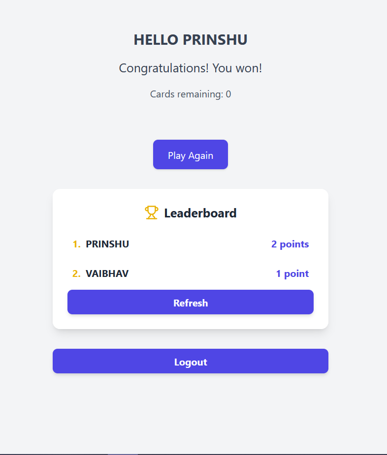

# Exploding Kitten


## Table of Contents
1. [Project Overview](#project-overview)
2. [Features](#features)
3. [Technologies Used](#technologies-used)
4. [Frontend Setup](#frontend-setup)
   - [Installation](#installation)
   - [Running the Frontend](#running-the-frontend)
5. [Backend Setup](#backend-setup)
   - [Installation](#backend-installation)
   - [Running the Backend](#running-the-backend)


## Project Overview

**Exploding Kitten** is a web-based single-player card game where players draw cards from a deck. The game consists of four types of cards: Cat, Defuse, Shuffle, and Exploding Kitten. The player wins if they can draw all the cards.

### Game Rules:
- **Cat Card**: Safe to draw.
- **Defuse Card**: This can defuse the Exploding Kitten card.
- **Shuffle Card**: Shuffles the deck and resets the game.
- **Exploding Kitten**: Ends the game if drawn unless the player has a defuse card.

The application also includes features like a leaderboard to track players' scores, and game persistence to allow users to continue from where they left off.

## Features

- **Single-player gameplay** with deck management.
- **Game persistence** so users can continue their game after leaving.
- **Leaderboard** to record how many games they won
- **Responsive design** using React.

## Technologies Used

### Frontend:
- React, Redux
- Tailwind CSS

### Backend:
- GoLang (Server logic)
- Redis (Database to store user data)

---

## Frontend Setup

### Installation

1. Clone the repository:
   ```bash
   git clone https://github.com/prinshukumar22/ExplodingKittens-Emitrr.git
   cd ExplodingKittens-Emitrr/client

2. Install Dependencies
    ```bash
    npm install

### Running the Frontend
1. Run the Development Server:
    ```bash
    npm run dev

2. Open your browser and navigate to http://localhost:5173 to view the application.

## Backend Setup

### Installation

1. Navigate to the backend directory from the root directory:
   ```bash
   cd ExplodingKittens-Emitrr/server

2. Install Dependencies
    ```bash
    go mod tidy

3. Use your Redis connection URL to set up your Redis database.
   REDIS_URL: Redis connection URL, such as redis://localhost:6379/0

5. Ensure Redis is running. If you're using Docker, you can start Redis with:
   ```bash
    docker run --name redis -p 6379:6379 -d redis

### Running the Backend
1. Start the Backend Server:
    ```bash
    go run main.go

2. The server will run on http://localhost:8080

